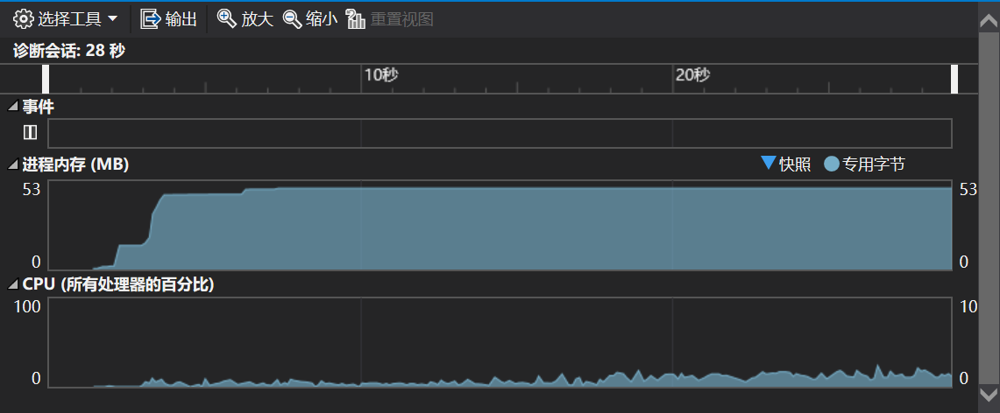

最近在面试找实习，没什么进度

从音频文件中提取出专辑封面图片建议使用`ffmpeg  -i xxx.mp3  xxx.jpg`

内核部分内存泄漏检查和CPU占用分析




稳定占用50多MB，没有内存持续上升的情况。CPU占用不高。

编译方式: autogen.bat 
参考[命令行编译sln工程](https://blog.csdn.net/u011046042/article/details/121468710)

看日志方式: [windows下grep](https://cloud.tencent.com/developer/ask/sof/43792)


ffmpeg 错误码
```cpp
/*
 * This file is part of FFmpeg.    
 * include/libavutil/error.h
 *
 * FFmpeg is free software; you can redistribute it and/or
 * modify it under the terms of the GNU Lesser General Public
 * License as published by the Free Software Foundation; either
 * version 2.1 of the License, or (at your option) any later version.
 *
 * FFmpeg is distributed in the hope that it will be useful,
 * but WITHOUT ANY WARRANTY; without even the implied warranty of
 * MERCHANTABILITY or FITNESS FOR A PARTICULAR PURPOSE.  See the GNU
 * Lesser General Public License for more details.
 *
 * You should have received a copy of the GNU Lesser General Public
 * License along with FFmpeg; if not, write to the Free Software
 * Foundation, Inc., 51 Franklin Street, Fifth Floor, Boston, MA 02110-1301 USA
 */
 
#ifndef AVUTIL_ERROR_H
#define AVUTIL_ERROR_H
 
#include <errno.h>
#include <stddef.h>
 
 
/* error handling */
#if EDOM > 0
#define AVERROR(e) (-(e))   ///< Returns a negative error code from a POSIX error code, to return from library functions.
#define AVUNERROR(e) (-(e)) ///< Returns a POSIX error code from a library function error return value.
#else
/* Some platforms have E* and errno already negated. */
#define AVERROR(e) (e)
#define AVUNERROR(e) (e)
#endif
 
#define FFERRTAG(a, b, c, d) (-(int)MKTAG(a, b, c, d))
// define in include/libavutil/common.h
// #define MKTAG(a,b,c,d) ((a) | ((b) << 8) | ((c) << 16) | ((unsigned)(d) << 24))
// #define MKBETAG(a,b,c,d) ((d) | ((c) << 8) | ((b) << 16) | ((unsigned)(a) << 24))
 
 
 
#define AVERROR_BSF_NOT_FOUND      FFERRTAG(0xF8,'B','S','F') ///< Bitstream filter not found
#define AVERROR_BUG                FFERRTAG( 'B','U','G','!') ///< Internal bug, also see AVERROR_BUG2
#define AVERROR_BUFFER_TOO_SMALL   FFERRTAG( 'B','U','F','S') ///< Buffer too small
#define AVERROR_DECODER_NOT_FOUND  FFERRTAG(0xF8,'D','E','C') ///< Decoder not found
#define AVERROR_DEMUXER_NOT_FOUND  FFERRTAG(0xF8,'D','E','M') ///< Demuxer not found
#define AVERROR_ENCODER_NOT_FOUND  FFERRTAG(0xF8,'E','N','C') ///< Encoder not found
#define AVERROR_EOF                FFERRTAG( 'E','O','F',' ') ///< End of file
#define AVERROR_EXIT               FFERRTAG( 'E','X','I','T') ///< Immediate exit was requested; the called function should not be restarted
#define AVERROR_EXTERNAL           FFERRTAG( 'E','X','T',' ') ///< Generic error in an external library
#define AVERROR_FILTER_NOT_FOUND   FFERRTAG(0xF8,'F','I','L') ///< Filter not found
#define AVERROR_INVALIDDATA        FFERRTAG( 'I','N','D','A') ///< Invalid data found when processing input
#define AVERROR_MUXER_NOT_FOUND    FFERRTAG(0xF8,'M','U','X') ///< Muxer not found
#define AVERROR_OPTION_NOT_FOUND   FFERRTAG(0xF8,'O','P','T') ///< Option not found
#define AVERROR_PATCHWELCOME       FFERRTAG( 'P','A','W','E') ///< Not yet implemented in FFmpeg, patches welcome
#define AVERROR_PROTOCOL_NOT_FOUND FFERRTAG(0xF8,'P','R','O') ///< Protocol not found
 
#define AVERROR_STREAM_NOT_FOUND   FFERRTAG(0xF8,'S','T','R') ///< Stream not found
/**
 * This is semantically identical to AVERROR_BUG
 * it has been introduced in Libav after our AVERROR_BUG and with a modified value.
 */
#define AVERROR_BUG2               FFERRTAG( 'B','U','G',' ')
#define AVERROR_UNKNOWN            FFERRTAG( 'U','N','K','N') ///< Unknown error, typically from an external library
#define AVERROR_EXPERIMENTAL       (-0x2bb2afa8) ///< Requested feature is flagged experimental. Set strict_std_compliance if you really want to use it.
#define AVERROR_INPUT_CHANGED      (-0x636e6701) ///< Input changed between calls. Reconfiguration is required. (can be OR-ed with AVERROR_OUTPUT_CHANGED)
#define AVERROR_OUTPUT_CHANGED     (-0x636e6702) ///< Output changed between calls. Reconfiguration is required. (can be OR-ed with AVERROR_INPUT_CHANGED)
/* HTTP & RTSP errors */
#define AVERROR_HTTP_BAD_REQUEST   FFERRTAG(0xF8,'4','0','0')
#define AVERROR_HTTP_UNAUTHORIZED  FFERRTAG(0xF8,'4','0','1')
#define AVERROR_HTTP_FORBIDDEN     FFERRTAG(0xF8,'4','0','3')
#define AVERROR_HTTP_NOT_FOUND     FFERRTAG(0xF8,'4','0','4')
#define AVERROR_HTTP_OTHER_4XX     FFERRTAG(0xF8,'4','X','X')
#define AVERROR_HTTP_SERVER_ERROR  FFERRTAG(0xF8,'5','X','X')
 
#define AV_ERROR_MAX_STRING_SIZE 64
 
/**
 * Put a description of the AVERROR code errnum in errbuf.
 * In case of failure the global variable errno is set to indicate the
 * error. Even in case of failure av_strerror() will print a generic
 * error message indicating the errnum provided to errbuf.
 *
 * @param errnum      error code to describe
 * @param errbuf      buffer to which description is written
 * @param errbuf_size the size in bytes of errbuf
 * @return 0 on success, a negative value if a description for errnum
 * cannot be found
 */
int av_strerror(int errnum, char *errbuf, size_t errbuf_size);
 
/**
 * Fill the provided buffer with a string containing an error string
 * corresponding to the AVERROR code errnum.
 *
 * @param errbuf         a buffer
 * @param errbuf_size    size in bytes of errbuf
 * @param errnum         error code to describe
 * @return the buffer in input, filled with the error description
 * @see av_strerror()
 */
static inline char *av_make_error_string(char *errbuf, size_t errbuf_size, int errnum)
{
    av_strerror(errnum, errbuf, errbuf_size);
    return errbuf;
}
 
/**
 * Convenience macro, the return value should be used only directly in
 * function arguments but never stand-alone.
 */
#define av_err2str(errnum) \
    av_make_error_string((char[AV_ERROR_MAX_STRING_SIZE]){0}, AV_ERROR_MAX_STRING_SIZE, errnum)
 
 
#endif /* AVUTIL_ERROR_H */
```